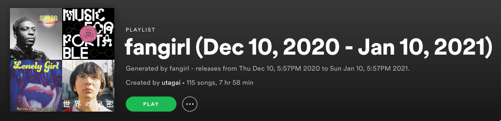

#  _fangirl_ 🤩

Fangirl helps me keep track of all the releases from my followed artists on [Spotify](https://www.spotify.com/).
It creates a playlist of recent releases. Here's an example of one it made:



## Motivation
Spotify has a section for tracking some releases, but the method they use to construct that list is opaque, and
seems to be missing some releases sometimes. Perhaps most importantly, if you don't listen to them all immediately,
you may miss a release from a favorite artist. There's some other issues too, e.g., you can't simply play all of
them in one go, or you can't remove them once you've finished listening to them and either decided to save it to
your library or not.

Putting all the releases into a playlist under your account fixes lots of these problems however. `fangirl` does
this.

## Usage
`fangirl` is dumb simple:
```
$ fangirl --help
Usage of ./fangirl:
  -blacklist string
        a path to a blacklist file containing artists to skip
  -duration duration
        the duration to consider 'recent'; defaults to 1 month (default 744h0m0s)
  -playlist string
        the name for the playlist containing recent releases
$ fangirl -playlist releases
> Generates a playlist, named "releases", containing all releases in the last month.
$ fangirl -playlist releases -duration 8928h
> Same as above, but gets releases put out in the last year.
```
Note that the `-duration` flag takes in a duration that is in the format of Golang's `time.Duration`.

### Credentials
Of course, you need Spotify developer credentials to run `fangirl`. `fangirl` looks in the environment
for credentials. In particular, it looks for:
* `SPOTIFY_CLIENT_ID` - For the Spotify client ID.
* `SPOTIFY_CLIENT_SECRET` - For the Spotify client secret.

You can make your own at the [Spotify developer dashboard](https://developer.spotify.com/dashboard/applications).

**NOTE** When making this app, make sure to set the callback URI to `http://localhost:8080/callback`.

Upon initial start-up, `fangirl` will request you to visit an OAuth2 page. `fangirl` hosts the callback URL you
set in the dashboard, and will get the necessary privileges to execute. On the next start-up, `fangirl` will
re-use the credentials it got from last time.

## Building
`fangirl` is just a pure Go program:
```
$ go build
```

## Considerations
There's a few pieces to `fangirl`'s behavior that are worth pointing out explicitly:
* `fangirl` is not _fast_. To do what it does, we need to issue hundreds, if not thousands of API requests to
Spotify. Furthermore, to avoid rate-limiting, we then have to throttle that. Personally, I run
`fangirl` in a monthly cron job.
* `fangirl` will always _create_ a new playlist, even if an identically named playlist already exists. It will
not append.
* `fangirl` will _not_ add releases that you've already liked. However, if you've listened to it and don't
like it, a subsequent invocation will possibly add the release again, since `fangirl` does not know if you've
listened to the song already. Hopefully, you follow artists you mostly like, and so most releases will be liked.
* `fangirl` emits logs during execution detailing what it is doing. However, `fangirl` explicitly separates its
_read_ operations from its final _write_ operation of creating the playlist. This means that a failure prior to
playlist creation will not create incremental work.
* The playlist name isn't exactly honored. See the screenshot for additional information `fangirl` appends to the
name.
* `fangirl` does not handle cases where a playlist size exceeds 10,000, which is the maximum playlist size. It is
fixable by overflowing into multiple playlists, but it isn't something I've personally faced. Open an issue if its
a problem for you. Otherwise, I'll fix it if I ever need to.
* On initial run, you'll have to go through the OAuth2 flow. Afterwards, `fangirl` will save the OAuth2 token in
your cache directory. On Unix, that's likely going to be `~/.cache/fangirl/`.
* `fangirl` defines a "release" as an album that is either a typical album, a compilation or a single.
